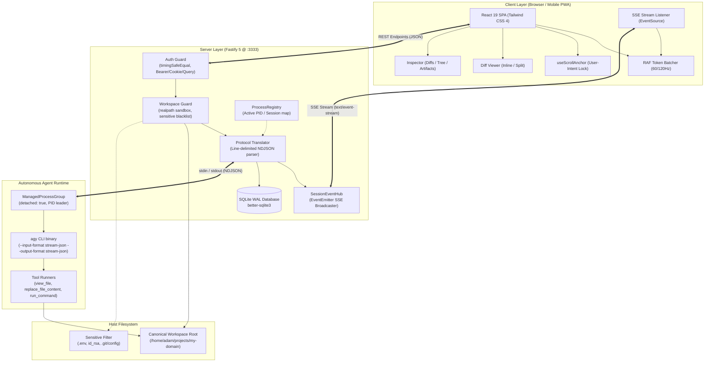

# Antigravity Web (`antigravity-web`)

> **Autonomous Full-Stack Agent Interface & Developer Cockpit**  
> Real-time streaming UI, diff inspector, sandboxed workspace explorer, and execution supervisor for the Antigravity Autonomous Agent (`agy`).

[](https://nodejs.org)
[](https://fastify.dev)
[](https://react.dev)
[](https://www.typescriptlang.org)
[](https://tailwindcss.com)
[](https://sqlite.org)

---

## Table of Contents

1. [Overview](#overview)
2. [Architecture](#architecture)
3. [Key Features](#key-features)
4. [Security Architecture](#security-architecture)
5. [Process Group & Subprocess Lifecycle](#process-group--subprocess-lifecycle)
6. [API Routes & Streaming Protocol](#api-routes--streaming-protocol)
7. [Scripts & Development Workflow](#scripts--development-workflow)
8. [Configuration & Environment Variables](#configuration--environment-variables)
9. [Automated Verification & Testing](#automated-verification--testing)

---

## Overview

**Antigravity Web** is a production-grade, reactive web cockpit engineered to supervise and collaborate with autonomous AI developer agents (`agy`). Built with **Fastify 5** on the backend and **React 19** on the frontend, it provides a low-latency, resilient bridge between human engineers and autonomous coding workflows.

### Why Antigravity Web?

Autonomous agents produce continuous, interleaved streams of high-frequency events: reasoning thoughts, command-line executions, file modifications, ripgrep searches, and implementation plans. Standard web interfaces struggle with:
- **Render Saturation & Frame Drops**: High token output (>100 tokens/sec) exhausts React render loops.
- **Zombie Agent Subprocesses**: Cancelling a web request frequently leaves background compiler or testing tasks running indefinitely.
- **Workspace Security Exploits**: Arbitrary file viewing poses directory traversal (`../`) and credential exfiltration risks.
- **Lost Context on Disconnect**: Ephemeral sessions lose state if browser tabs are reloaded or connection drops.

Antigravity Web solves these challenges through:
- **Zero-Layout-Thrashing Streaming**: RequestAnimationFrame (RAF) token batching queues stream deltas and commits them once per display refresh cycle (~16.6ms at 60Hz), capped with fallback timeouts for background tabs.
- **POSIX Process Group Detachment**: The supervisor spawns agents in detached process groups and executes a 3-stage escalation ladder (`SIGINT` &rarr; `SIGTERM` &rarr; `SIGKILL`) across negative PIDs (`-pid`) to terminate entire process trees without orphaned children.
- **Hardened Security Boundaries**: Constant-time cryptographic token verification (`crypto.timingSafeEqual`) and canonical realpath sandboxing with strict blacklists for secrets (`.env`, SSH keys, cloud credentials).
- **Persistent SQLite WAL Storage**: ACID-compliant session history, messages, tool execution telemetry, and unified file diffs persisted via `better-sqlite3` with Write-Ahead Logging (WAL) and foreign keys.

---

## Architecture

The system operates as an asynchronous decoupled architecture communicating over HTTP REST and Server-Sent Events (SSE):



### Component Breakdown

| Component | Technology | Responsibility |
| --- | --- | --- |
| **Frontend Core** | React 19, TypeScript, Vite 6 | Responsive developer workspace, message timeline, mobile tabs, theme provider. |
| **Design System** | Tailwind CSS 4, Lucide Icons | Responsive typography (`Inter` / `JetBrains Mono`), dark/light mode, mobile touch targets (&ge;48px). |
| **Diff Engine** | `diff`, `@codemirror/*` | Inline and side-by-side syntax-highlighted diffs, additions/deletions badges, clipboard export. |
| **Backend Core** | Fastify 5, Node.js 22 | High-throughput HTTP server, CORS, cookie parsing, static asset hosting, SPA routing fallback. |
| **Data Persistence** | SQLite 3 (`better-sqlite3`) | Sessions, turns, tool outputs, diffs, artifacts, and settings with WAL mode and foreign key constraints. |
| **Process Group** | Node.js `child_process` | Detached process group supervisor with escalation kill ladder (`-pid`). |
| **Protocol Translator**| Line-by-line NDJSON Parser | Translates `agy` stream-json events (`step_update`, `agent_response`, `tool`, `result`) into normalized SSE events. |

---

## Key Features

### 1. Real-Time Token Streaming with RAF Batching
- **No Layout Thrashing**: Incoming token chunks are buffered and flushed synchronously on `window.requestAnimationFrame`.
- **Background Tab Protection**: When tabs are minimized and RAF is throttled by browsers, an automatic `maxDelayMs` timer (default 50ms) flushes pending tokens to maintain live UI state.
- **Smart Scroll Anchoring**: Tracks scroll position and locks viewport to bottom only if user hasn't scrolled up to review previous output.

### 2. Collapsible Reasoning Thoughts ("Tok Myślenia")
- Visualizes the agent's internal cognitive deliberation before executing actions.
- Displays elapsed reasoning time (`duration_ms`), spinning status indicators during generation, and automatic completion collapse.

### 3. Interactive Tool Execution Cards
- Real-time tool status badges: `pending`, `running`, `completed`, `failed`.
- Detailed parameter inspector and formatted tool outputs.
- Dedicated semantic icons for `FileText`, `FilePlus`, `FileCode`, `Terminal`, `Search`, and `FolderSearch`.
- One-click jump to inspect synthesized file diffs directly in the right-hand Inspector.

### 4. Code Diff & Change Viewer
- Two presentation modes: **Inline** (unified) and **Split** (side-by-side).
- Addition (`+N`) and deletion (`-N`) summary tags.
- Direct copy of modified code to clipboard.

### 5. Sandboxed Workspace Tree & File Viewer
- Explores project directories up to configurable recursion depth (default 4 levels).
- Sensitive directory pruning (`node_modules`, `.git`, `dist`, `build`, `.turbo`).
- File preview with automatic size checks (5MB ceiling).

### 6. Implementation Plans & Artifacts
- Dedicated inspector tab for markdown specifications, task checklists, and architectural notes produced by the agent.
- Formatted with GFM tables, checklists, and fenced code blocks.

### 7. Slash Command Subsystem
Antigravity Web intercepts developer slash commands client-side and server-side:
- `/plan` &mdash; Pre-populates the prompt composer with a structured implementation plan prompt.
- `/review` &mdash; Commands the agent to evaluate current git workspace changes and code quality.
- `/model [name]` &mdash; Inspects or switches the underlying LLM model for the active session.
- `/models` &mdash; Lists all available models supported by the agent (`gemini-3.8-flash-high`, `claude-sonnet-4-6`, `claude-opus-4-6-thinking`, etc.).
- `/effort [low|medium|high]` &mdash; Dynamically adjusts reasoning effort.
- `/status` &mdash; Reports active session metadata, model, effort, status, and workspace path.
- `/clear` &mdash; Resets canvas state or session status to idle.
- `/help` &mdash; Displays interactive command reference.

### 8. Mobile Ergonomics & Responsive UX
- Responsive breakpoint layout: desktop dual-pane with collapsible Inspector, tablet drawer, and mobile bottom tab navigation (`Czat`, `Zmiany`, `Pliki`, `Zadania`).
- Compliant with mobile human interface guidelines: touch targets &ge;48px &times; 48px, safe-area inset padding (`h-dvh`), and zero horizontal overflow.
- Natural Polish localization across all notifications, status indicators, and tool cards.

---

## Security Architecture

Antigravity Web implements a defense-in-depth security model to safeguard host servers against unauthorized remote execution and secret leakage:

```
                  Client Request
                        │
                        ▼
         ┌───────────────────────────────┐
         │       Security Layer 1        │
         │   Timing-Safe Auth Guard      │
         └──────────────┬────────────────┘
                        │ Valid Token
                        ▼
         ┌───────────────────────────────┐
         │       Security Layer 2        │
         │   Canonical Workspace Guard   │
         │  (realpath + boundary check)  │
         └──────────────┬────────────────┘
                        │ Safe Workspace Path
                        ▼
         ┌───────────────────────────────┐
         │       Security Layer 3        │
         │  Sensitive Pattern Blacklist  │
         │   (.env, id_rsa, .git, certs) │
         └──────────────┬────────────────┘
                        │ Clean Operation
                        ▼
         ┌───────────────────────────────┐
         │       Security Layer 4        │
         │  Process Group Detachment     │
         │  (isolated PGID + kill ladder)│
         └───────────────────────────────┘
```

### 1. Timing-Safe Authentication (`security/authGuard.ts`)
Standard string comparison (`===`) terminates on the first mismatched byte, exposing the server to statistical timing attacks. Antigravity Web enforces:
```typescript
export function timingSafeEqualStrings(a: string, b: string): boolean {
  const bufA = Buffer.from(a, 'utf-8');
  const bufB = Buffer.from(b, 'utf-8');

  if (bufA.length !== bufB.length) {
    // Execute dummy constant-time comparison to minimize branch timing divergence
    crypto.timingSafeEqual(bufA, bufA);
    return false;
  }
  return crypto.timingSafeEqual(bufA, bufB);
}
```

#### Token Extraction Priority
1. `Authorization: Bearer <token>` HTTP Header.
2. `x-auth-token: <token>` Custom HTTP Header.
3. `ag_auth` HttpOnly Cookie.
4. `?token=<token>` Query Parameter (required for browser `EventSource` which lacks custom header capabilities).

Public endpoints exempt from auth: `/health`, `/api/auth/login`, and static web bundle files.

### 2. Canonical Realpath Workspace Guard (`security/workspaceGuard.ts`)
To prevent directory traversal attacks (e.g. `../../etc/passwd` or symbolic link poisoning), all workspace interactions must resolve through `fs.realpathSync`:
- **Boundary Verification**:
  ```typescript
  const rootCanonical = fs.realpathSync(workspaceRoot);
  const isInside = realCandidate === rootCanonical || realCandidate.startsWith(rootCanonical + path.sep);
  if (!isInside) {
    throw new WorkspaceSecurityError('Access denied: path traversal out of workspace root', 403);
  }
  ```
- **Sensitive File Blacklisting**:
  Blocks direct access to files matching high-risk signatures:
  - `.env`, `.env.*`
  - Private SSH keys: `id_rsa`, `id_ed25519`, `id_ecdsa` (and `.pub`)
  - TLS / Private Keys: `*.pem`, `*.key`, `*.pfx`, `*.p12`
  - Git Credentials: `.git/config`, `.git/credentials`
  - Cloud Service Accounts: `credential*.json`, `service_account*.json`, `.aws/*`, `.ssh/*`
- **Memory Exhaustion Guard**: Files larger than 5 MB are rejected with HTTP 413.

---

## Process Group & Subprocess Lifecycle

When the user initiates a prompt, the server spawns the agent CLI using `child_process.spawn`:

```typescript
const spawnOptions: SpawnOptions = {
  detached: true, // Creates a new POSIX process group with child as leader
  cwd: session.workspace_path,
  stdio: ['pipe', 'pipe', 'pipe'],
};
```

### Escalation Termination Ladder

Killing a single process ID (`kill(pid)`) frequently abandons child processes (such as child bash shells, linters, or compilation tasks) in an orphaned state. Antigravity Web targets the **negative Process Group ID (`-pid`)** and applies an escalating kill ladder:

```
[User Abort / Session Cancellation]
                │
                ▼
      Step 1: SIGINT to -pid
                │
        Wait up to 2,500ms
                │
    Exited? ──► YES ──► Terminated cleanly
        │ NO
        ▼
      Step 2: SIGTERM to -pid
                │
        Wait up to 1,000ms
                │
    Exited? ──► YES ──► Terminated
        │ NO
        ▼
      Step 3: SIGKILL to -pid (Force Kill)
                │
      Wait 500ms ──► Fully Cleaned
```

---

## API Routes & Streaming Protocol

### REST Endpoints

#### Health & Status
- **`GET /health`**  
  Returns server health, uptime, WAL mode verification, and active process count.
  ```json
  {
    "status": "ok",
    "version": "1.0.0",
    "uptime_seconds": 1284,
    "wal_mode": true,
    "active_sessions": 1,
    "timestamp": 1772660105000
  }
  ```

#### Authentication
- **`POST /api/auth/login`**  
  Validates secret token and issues `ag_auth` HttpOnly cookie.  
  *Body:* `{ "token": "string" }`  
  *Response (200):* `{ "success": true, "message": "Authentication successful" }`
- **`GET /api/auth/me`**  
  Returns user context, workspace root, and default agent model.
- **`POST /api/auth/logout`**  
  Clears the authentication cookie.

#### Session Management
- **`GET /api/sessions`**  
  Lists all persistent chat sessions ordered by `updated_at DESC`. Includes message count, tool count, and last message snippet.
- **`POST /api/sessions`**  
  Creates a new conversation session.  
  *Body:* `{ "title"?: string, "workspace_path"?: string, "model"?: string, "effort"?: "low"|"medium"|"high" }`
- **`GET /api/sessions/:id`**  
  Returns fully hydrated session state: messages, sequence numbers, tool execution cards with timestamps, associated diffs, and artifacts.
- **`PATCH /api/sessions/:id`**  
  Updates session title, model, effort, or status.
- **`DELETE /api/sessions/:id`**  
  Cancels any active agent process for this session and cascades deletion of messages, tools, diffs, and artifacts.
- **`POST /api/sessions/:id/prompt`**  
  Accepts a user prompt and initiates agent turn processing asynchronously.  
  *Body:* `{ "prompt": "string", "model"?: string, "effort"?: "low"|"medium"|"high" }`  
  *Response (202 Accepted):* `{ "accepted": true, "session_id": "string" }`
- **`POST /api/sessions/:id/cancel`**  
  Triggers process group termination for the session and updates state to `aborted`.

#### Workspace Exploration
- **`GET /api/workspace/tree?depth=4&root=/path`**  
  Returns filtered hierarchical directory tree starting from canonical workspace root.
- **`GET /api/workspace/file?path=relative/file.ts&root=/path`**  
  Returns verified file contents, file size, and last modified timestamp.

---

### Real-Time SSE Stream Protocol (`GET /api/sessions/:id/stream`)

Streams real-time events formatted according to W3C Server-Sent Events standards. Supports auto-reconnect and includes periodic `: keep-alive\n\n` heartbeats every 15 seconds.

```text
id: 1
event: session_status
data: {"seq":1,"session_id":"uuid","timestamp":1772660105000,"type":"session_status","payload":{"status":"running"}}

id: 2
event: message_delta
data: {"seq":2,"session_id":"uuid","timestamp":1772660105020,"type":"message_delta","payload":{"step_index":0,"delta":"Hello"}}
```

#### Event Catalog

| Event Name | Payload Structure | Description |
| --- | --- | --- |
| `session_status` | `{ "status": "idle" \| "running" \| "completed" \| "aborted" \| "failed" }` | Lifecycle transitions of the active session. |
| `thought_delta` | `{ "step_index": number, "delta": string }` | Stream chunk for the agent's internal reasoning process. |
| `thought_complete`| `{ "step_index": number, "thought": string, "duration_ms": number }` | Completed thought block with duration telemetry. |
| `message_delta` | `{ "step_index": number, "delta": string }` | Assistant output token chunk (buffered via RAF on client). |
| `message_complete`| `{ "message_id": string, "content": string, "usage"?: TokenUsage }` | Completed assistant response with token counts. |
| `tool_start` | `{ "tool_execution_id": string, "step_index": number, "tool_name": string, "tool_args": object }` | Triggered when the agent begins executing a tool. |
| `tool_progress` | `{ "tool_execution_id": string, "step_index": number, "chunk": string }` | Incremental stdout/stderr output from a running tool. |
| `tool_complete` | `{ "tool_execution_id": string, "step_index": number, "tool_name": string, "output": string, "duration_ms": number, "status": ToolStatus }` | Tool execution finished successfully or with errors. |
| `diff_created` | `{ "diff_id": string, "tool_execution_id": string, "file_path": string, "before_content": string, "after_content": string, "additions": number, "deletions": number }` | Synthesized file diff from code modification tools. |
| `slash_command_result` | `{ "command": string, "output": string }` | Fast response from intercepted slash commands. |
| `turn_error` | `{ "error": string }` | Fatal error details during the agent turn. |
| `heartbeat` | `: keep-alive` (comment line) | Emitted every 15s to keep proxy connections and buffers alive. |

---

## Scripts & Development Workflow

The root repository orchestrates npm workspaces for `client` and `server`:

### Root Scripts (`package.json`)

```bash
# 1. Run both Fastify backend (:3333) and Vite frontend (:5173) concurrently
npm run dev

# 2. Run backend only in watch mode
npm run dev:server

# 3. Run frontend Vite dev server only
npm run dev:client

# 4. Build both server and client for production
npm run build

# 5. Populate SQLite database with seed data (sessions, tools, diffs, artifacts)
npm run seed

# 6. Execute server integration test suite
npm test

# 7. Start compiled production server (serves static client assets automatically)
npm start
```

### Server Workspace Scripts (`server/package.json`)

```bash
# Start backend in development with tsx file-watcher
npm run dev --prefix server

# Compile TypeScript to dist/
npm run build --prefix server

# Execute database seeding script
npm run seed --prefix server

# Execute test suite
npm run test --prefix server

# Start compiled server from dist/index.js
npm start --prefix server
```

### Client Workspace Scripts (`client/package.json`)

```bash
# Start Vite development server with Hot Module Replacement (HMR)
npm run dev --prefix client

# Typecheck and build production bundle into client/dist
npm run build --prefix client

# Locally preview the production build
npm run preview --prefix client
```

---

## Configuration & Environment Variables

Create a `.env` file in `server/.env` or specify environment variables via your process manager / Docker:

| Variable | Type | Default | Description |
| --- | --- | --- | --- |
| `PORT` | `number` | `3333` | Port on which Fastify listens. |
| `HOST` | `string` | `0.0.0.0` | Host interface binding. |
| `AUTH_TOKEN` | `string` | `antigravity-dev-token` | Master authentication token. |
| `COOKIE_SECRET` | `string` | `ag-session-secret-key-2025` | Signing secret for Fastify cookie plugin. |
| `WORKSPACE_ROOT`| `string` | `..` (parent dir) | Default root folder for workspace file inspection. |
| `AGY_BIN` | `string` | `agy` | Path to the Antigravity CLI binary executable. |
| `DB_PATH` | `string` | `./data/antigravity.db`| SQLite database file path. |
| `LOG_LEVEL` | `string` | `info` | Fastify logger verbosity (`debug`, `info`, `warn`, `error`). |
| `AUTH_DISABLED` | `boolean`| `false` | Set to `true` strictly for local testing without credentials. |

---

## Automated Verification & Testing

Antigravity Web includes dedicated end-to-end and visual regression verification suites:

### 1. API Matrix Test Suite (`test_api_matrix.mjs`)
Validates 40+ contract points across health checks, timing-safe authentication, session lifecycle, slash command handling, workspace traversal protection, and latency percentiles (p50/p90/p99):
```bash
node test_api_matrix.mjs
```

### 2. Multi-Device Visual Verification Suite (`test_visual_suite.cjs`)
Performs automated headless browser inspection across multiple viewports:
- **Desktop** (1440 &times; 900)
- **Apple iPad Pro 11"** (834 &times; 1194)
- **Apple iPhone 16 Pro** (393 &times; 852)
- **Google Pixel 9 Pro** (412 &times; 924)

Verifies:
- Touch target sizes adhere to accessibility guidelines (&ge;48 &times; 48px).
- Zero horizontal layout overflow (`scrollWidth === docWidth`).
- Polish font hierarchy and typography rendering.
- Stored reports in `test-artifacts/screenshots/visual_verification_report.json`.

---

*Authored for the **barczynski.dev** ecosystem. Maintained by Adam Barczynski.*
